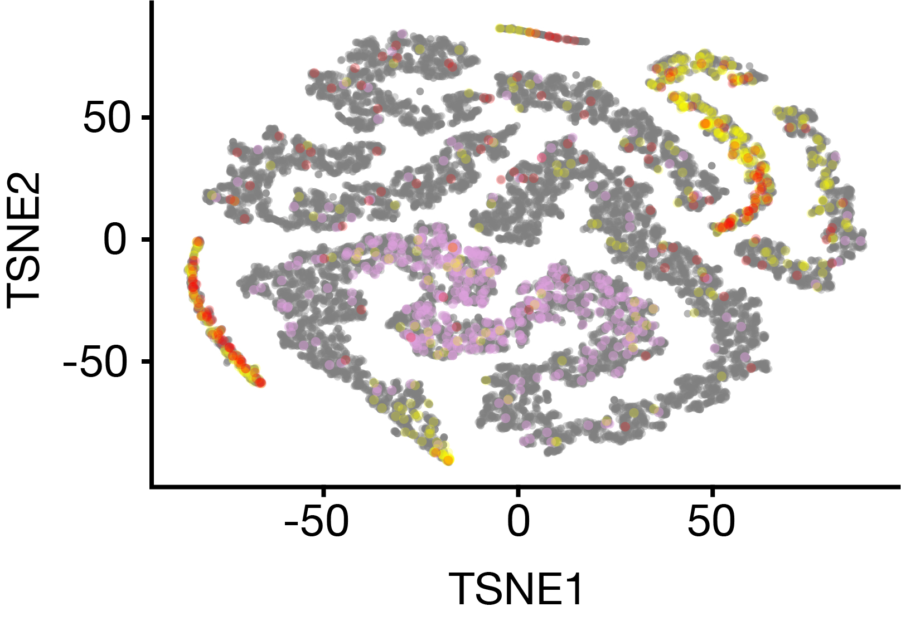
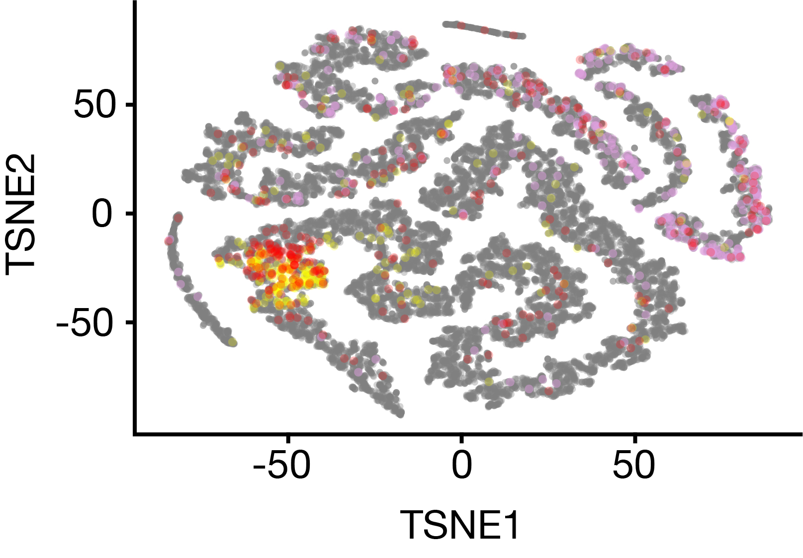
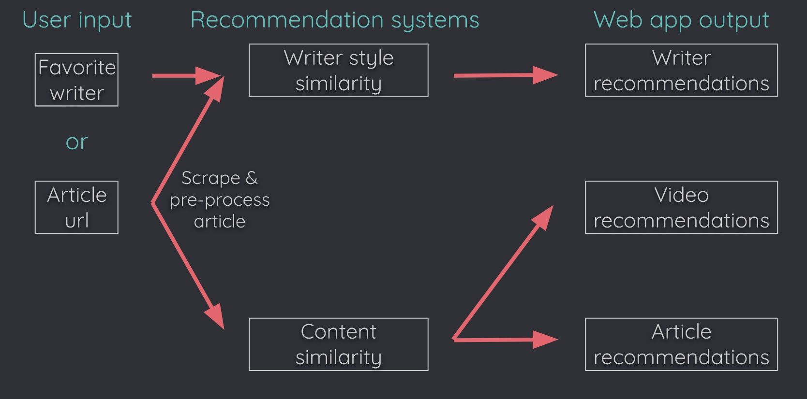
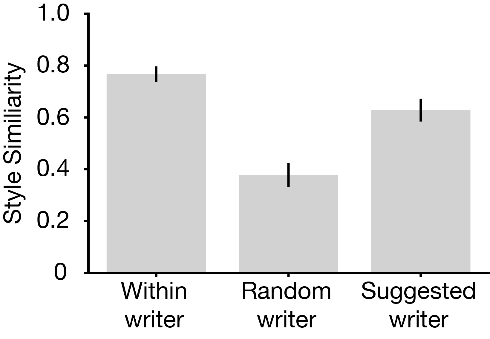
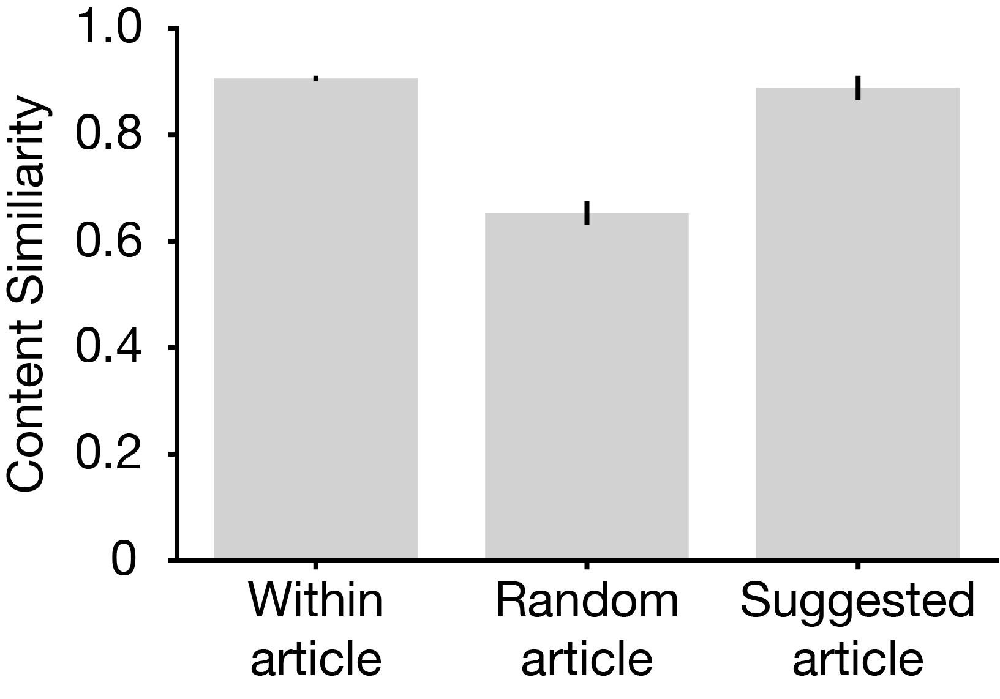
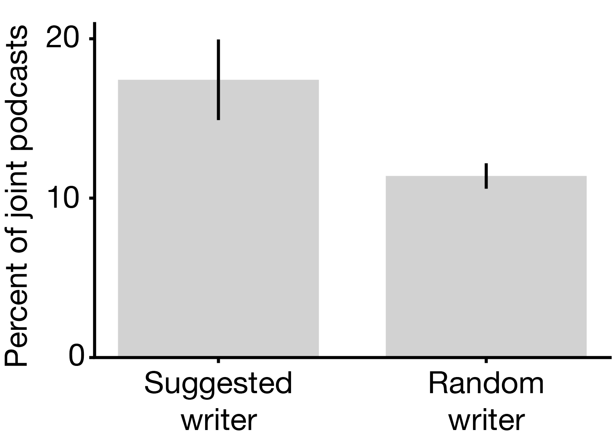

# Insight_writers

# Full Court Presser

## Find your favorite NBA writers

[Full Court Presser](www.fullcourtpresser.com) is a web app that quantifies writing style and content to find the best NBA content for you. The NBA is a rapidly growing market, having made $7.4 billion in 2017, up 32% from the year before. With this rapid growth comes a drastic increase in the number of fans watching NBA games and consuming NBA media content. How does a new NBA fan find the best NBA media content when this content is spread across many different media platforms? The factor that differentiates Full Court Presser from other news aggregators is the dual-pronged recommendation system that quantifies writer style and content. Importantly, while for this three week project I have focused on the NBA as a market, this approach can generalize to many different topics and is in no way limited to just sports.

## The data

To try and answer these questions I scraped over 20,000 articles from 823 different websites for a total dataset of over 15 million words. I initially scraped metadata and url links for over 100 different NBA writers from [www.muckrack.com](www.muckrack.com), a PR software platform which contains an extensive media database for journalists. Each NBA writer has a webpage / profile that I scraped to get the url for their most recently written articles.

I then used these links to scrape the articles from each writer (articles were on 823 different websites, some of the top platforms include espn.com, theringer.com, theathletic.com, si.com, bleacherreport.com, etc.) and stored the article text and metadata in a Mongo database. I chose MongoDB because of how well it deals with unstructured documents like article text. 

## Quantifying writing style

One of the unique aspects of Full Court Presser is that I will quantifying the writing style of a given article or writer to suggest other articles or writers that are stylistically similar. So how do I quantify writing style to make suggestions? I will define specific features that allows to me assign hard numbers to writer style and then use a cosine similarity metric to suggest writers with a similar writing style. For example, I can assay how readable an article is by looking at average word or sentence length in a given article, and how much this varies across the entirety of the article. I can also quantify how opinionated an article is using VADER to perform sentiment analysis on each sentence and how much this varies across the article. For example, an article that is outlining the possible strengths and weaknesses of a given team would have more variable sentiment than an article reporting the score of a specific NBA game the night before. Using a battery of such features stored in a PostgreSQL database, I can start to evaluate the writing style of different writers and articles:

In this plot each dot corresponds to a single article and each cluster roughly corresponds to a different writing style. Using a non-linear dimensionality approach like t-SNE allows me to show that two writers that are considered  stylistically similar using a cosine similarity metric (Zach Lowe in red and Lee Jenkins in yellow) are highly overlapping and in the same clusters, and are not near Rob Lopez whose articles/dots are shown here in pink.

Here is another pair of 3 writers with Tim Kawakami and Blake Murphy in red and yellow respectively, and the articles by Jonathan Tjarks in pink. Again, the stylistically similar Tim Kawakami and Blake Murphy are clustered together.

## Suggesting similar content

In order to suggest similar content, I trained a word2vec model on the entire corpus of articles. This allows me to convert words to vectors and infer context and associations between words. I used a continuous-bag-of-words approach for my word2vec model. As a concrete example, this allows me to associate 'dynasty,' 'legacy,' and 'greatness' to the words 'Lebron' + 'history.' To calculate the vector for an entire article, I average across all words in the article that are part of my vocabulary. While I am fully aware that this is a simplistic approach, since I am dealing with exclusively NBA articles and a three-week project time-scale, this works rather well (see validations section below). In the future, I would further explore GloVe or Doc2Vec as potential alternative models.

## Web app and analysis pipeline

I then designed a Web App using Dash and hosted the website on Amazon Web Services at [fullcourtpresser.com](www.fullcourtpresser.com). A user enters their favorite current writer or the url of an article they have recently read. I scrape the article from the entered website, I pre-process the article and pass the text through my writing style recommendation system and my content based recommendation system. The user will then receive recommendations for other writers the user may enjoy as well as access to articles and video about similar content. The video recommendation is via named entity recognition and incorporation of the Youtube api. Importantly the user can view all article and video content within the webpage. See below for an image of the analysis pipeline:

## Validation

Validations for a recommendation system can be tricky, especially considering my three-week timeline. I took two different approaches. One was internal and based off the articles themselves, and the other was external. Internally, I took the split article approach. First, I selected 3 writers: #1, #2, and #3. Writer #2 is a randomly selected writer and writer #3 is a writer who is stylistically similar to writer #1. I then randomly select an article from all 3 writers, split their articles in half and calculate the writing style similarity for all permutations of combinations, i.e. writer #1 with him/her self, writer #1 with writer #2 (random match), or writer #1 with writer #3 (suggested match). After bootstrapping this 50x, I found that the writing similarity for my suggested match was 68% better than with a random writer and was quite close to within article controls (first vs. second half of the same article):

I can also take the same approach of splitting articles and calculating a cosine similarity metric for my content recommendations. To do this I ignore the writers and either take articles that are similar in content according to my word2vec model, or randomly sample any article. When I took this approach I found that the writing content for my suggested articles was 35% better than chance as shown below. While this number might not be eye-popping, as a reminder, this is a content recommendation within the constraints of an NBA article:

I externally validated my writing style recommendations by using the api from [listennotes.com](www.listennotes.com) to collect the metadata about podcasts an NBA writer might have participated in. By searching for a given NBA writer I can find all podcasts that they have either hosted or participated in. I found that writers that have a similar writing style were 55% more likely to do a podcast together than writers who are not stylistically similar (see below). This is often because writers will host other writers to talk about their most recent article on their podcast. While the overall percentage is low (not all NBA writers participate in podcasts), the difference is statistically significant:

## Future directions

* Study the evolution of writing style with time
	* How has the media platform affected the writing style of different writers?
	* Does this affect the popularity of these writers (use the NBA writer twitter poll rankings)?

* Does this approach generalize to topics beyond the NBA
	* Can I use the quantification of writing style to make suggestions outside of the NBA or sports?
	* Can I make book or screenplay suggestions using a similar approach?

### Notebooks included

* [Scraping muckrack.com](get_content/Test_getMuckrack.ipynb)
* [Scraping all articles](get_content/Test_ScrapeContent.ipynb)
* [Scraping podcasts and analysis](get_content/get_podcast_info_new.ipynb)
* [Writing style analysis](process_text/analyze_articles.ipynb)
* [Content analysis](get_content/content_comparison.ipynb)
* [Internal validation analysis](validation/validations_notebook.ipynb)

